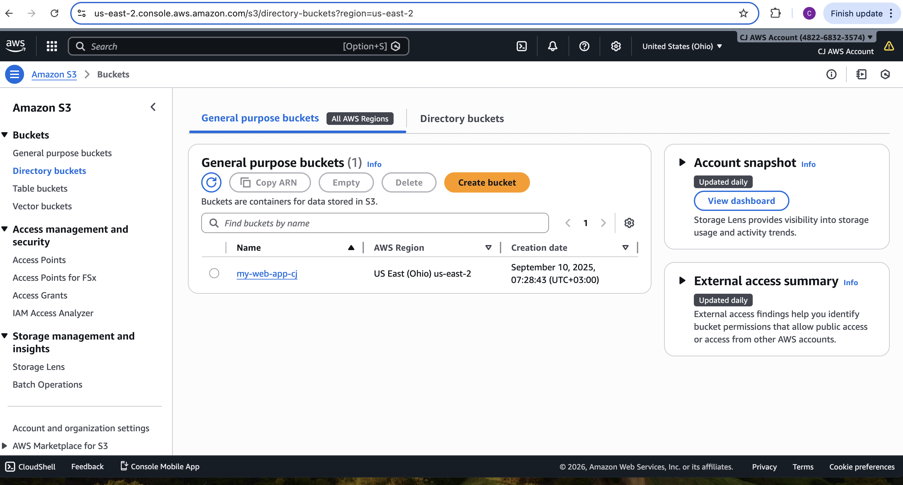
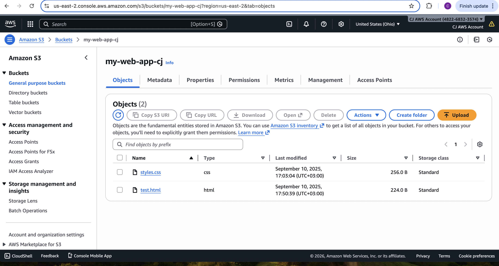
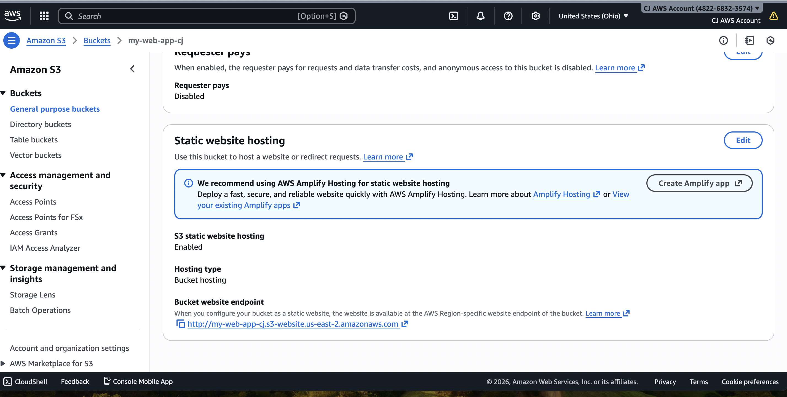
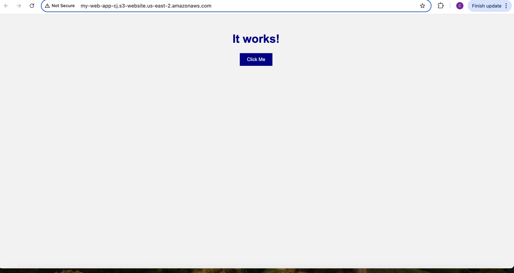
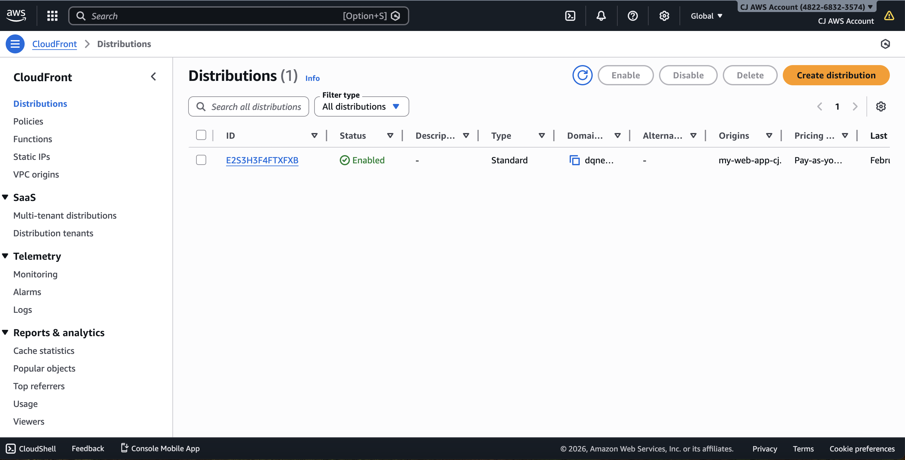

## Screenshots

### S3 Bucket

### Bucket Contents

### Static Hosting Enabled

### Website Live

### CloudFront CDN Integration

## Architecture Upgrade: Private S3 with CloudFront OAC

Secured the S3 bucket by removing public access and configuring CloudFront Origin Access Control (OAC). The website is now only accessible through CloudFront.

Architecture:

User → CloudFront → Private S3 bucket

Security improvement:
- Removed public read access
- Implemented Origin Access Control
- Prevented direct S3 access

Result:
Production-level secure static website hosting.

